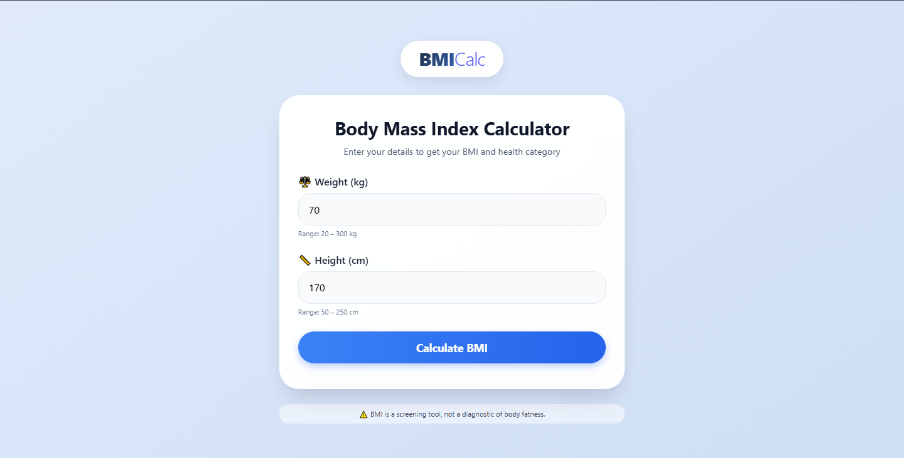

<div align="center">

# 🧮 BMI Calculator

**A lightweight, user-friendly web application to calculate BMI and generate a downloadable health report.**

[](https://www.python.org/)
[](https://flask.palletsprojects.com/)
[](https://opensource.org/licenses/MIT)
[](#)

<!--[**🌐 Live Server**](#) •-->
<!--[**Screenshots**](#-screenshots) •-->
[**Explore Features**](#-features) •
[**Installation**](#-quick-start) •
[**Project Structure**](#-project-structure)

</div>

---

## 🌟 About The Project

**BMI Calculator** is a simple Flask-based web application that calculates **Body Mass Index (BMI)** using user-provided **weight (kg)** and **height (cm)**. It also categorizes BMI into common health ranges and lets users download the result as a **Word document (.doc)**.

### 🔑 Key Highlights:
- 🚀 Clean & responsive UI
- 🧠 BMI calculation with category detection
- 🛡️ Input validation (both client-side and server-side)
- 📄 Downloadable BMI health report

## 🎯 Features
- BMI calculation using the formula: **BMI = weight(kg) / height(m)²**
- Categories:
  - Underweight
  - Normal weight
  - Overweight
  - Obese
- Error handling for invalid inputs
- Download result as `.doc`

---

## 🚀 Quick Start

### Prerequisites
Make sure you have **Python 3.7+** installed.

### Installation

```bash
# Install Flask
pip install flask

# Run the app
python app.py
```

> 🌐 Visit `http://localhost:5000` in your browser.

---

## 📸 Screenshots

*(Add your screenshots here. Example: place images inside `ScreenShots/` and update the links above.)*

---

## 🧾 BMI Categories
- **Underweight**: BMI < 18.5
- **Normal weight**: 18.5 ≤ BMI < 25
- **Overweight**: 25 ≤ BMI < 30
- **Obese**: BMI ≥ 30

---

## 🧩 Project Structure

```text
bmi-calculator/
├── app.py                 # Flask backend
├── templates/
│   └── index.html        # UI
├── static/
│   ├── style.css         # Styling
│   └── script.js         # Frontend logic
└── README.md
```

---

## 🔧 API Endpoint

### `POST /calculate`

Request body (JSON):

```json
{
  "weight": 70,
  "height": 170
}
```

Response (JSON):

```json
{
  "bmi": 24.2,
  "category": "Normal weight",
  "weight": 70.0,
  "height": 170.0
}
```

Errors return:

```json
{ "error": "...message..." }
```

---

## ⚠️ Notes

BMI is a screening tool and is **not a medical diagnosis**.


---

## 🎯 Features


- Calculate BMI from **Weight (kg)** and **Height (cm)**
- Displays BMI value + health category
- Client-side validation and server-side validation
- Download the result as a **.doc** file (Word-compatible HTML)

## Project Structure

- `app.py` - Flask backend (routes + BMI calculation)
- `templates/index.html` - Main UI
- `static/style.css` - Styling
- `static/script.js` - Frontend logic (fetch + rendering + download)

## How BMI Category is Determined

- **Underweight**: BMI < 18.5
- **Normal weight**: 18.5 ≤ BMI < 25
- **Overweight**: 25 ≤ BMI < 30
- **Obese**: BMI ≥ 30

## Setup & Run

### 1) Install dependencies

```bash
pip install flask
```

### 2) Start the server

```bash
python app.py
```

Open your browser and go to:

- `http://localhost:5000/`

## API Endpoint

### `POST /calculate`

Request body (JSON):

```json
{
  "weight": 70,
  "height": 170
}
```

Response (JSON):

```json
{
  "bmi": 24.2,
  "category": "Normal weight",
  "weight": 70.0,
  "height": 170.0
}
```

Errors return:

```json
{ "error": "...message..." }
```

## Validation

Server-side limits:

- Weight must be between **20 and 300 kg**
- Height must be between **50 and 250 cm**

## Download Result

After calculating, click **“Download Result as DOC”**.

The file is generated as Word-compatible HTML and saved as:

- `BMI_Report_<bmi>_<category>.doc`

## Notes

BMI is a screening tool, not a diagnostic of body fatness.

